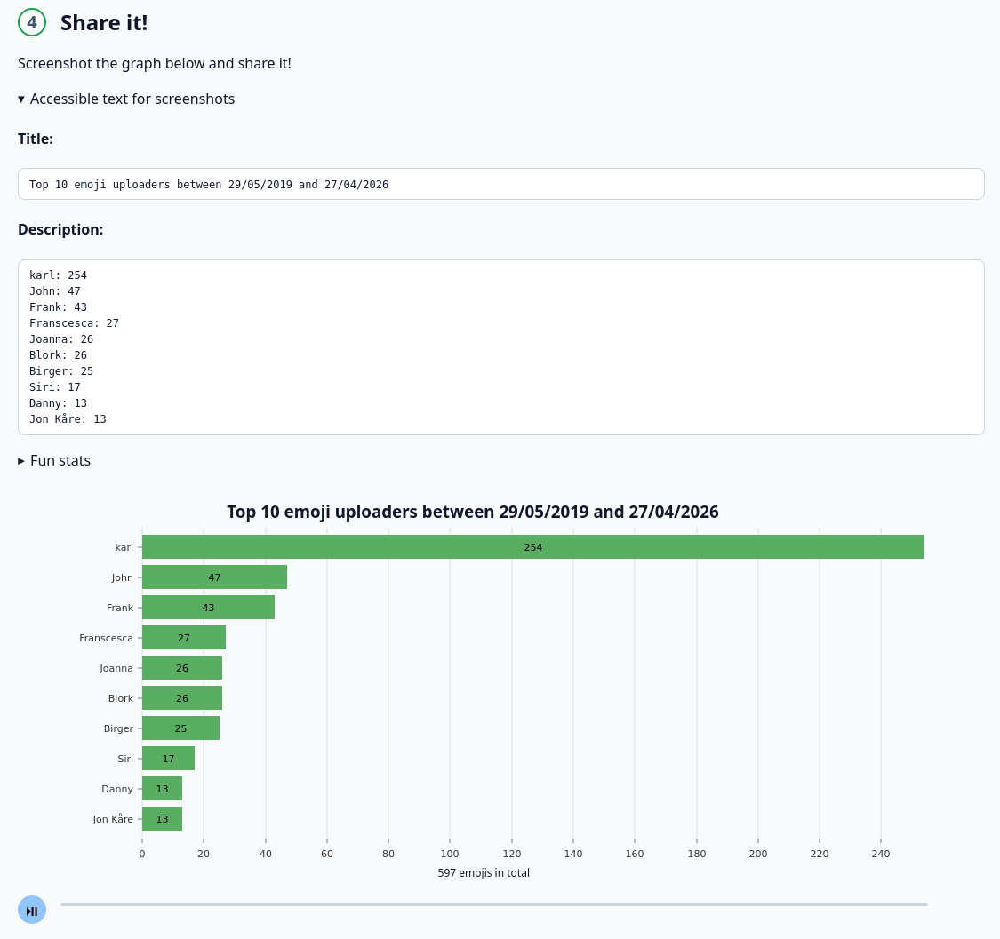

import { Image } from 'astro:assets';
import animation from 'animation.mp4';

One of the sillier things I've made, but the Slack workspace at [Nav IT](https://www.detsombetyrnoe.no/) the amount of
emojis grew every day. I witnessed the total go from just a few thousand to at the time of writing (2026) nearing almost
10 000 emojis.

With this amount of emojis it's natural that there are a few "whales" that upload a lot of emojis. So this app crunches
the data and provides a little screenshottable graph, as well as providing automatic alt-text for your screenshot and
some fun stats.

While getting the data is very finicky - it literally requires you to hack around with dev-tools to do a API-call to the
Slack - once you have the data, you can even make a animation that plays through the entire history from the start to
today!

<video className="mb-4" src={animation} autoPlay loop />

If you're comfortable with hacking the devtools you can use it your self at [emoji.karl.run](https://emoji.karl.run).
