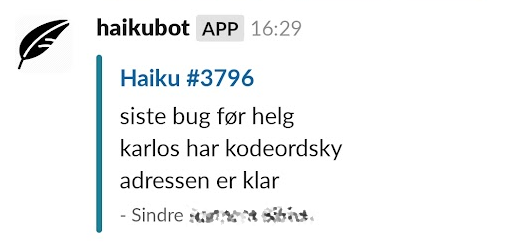
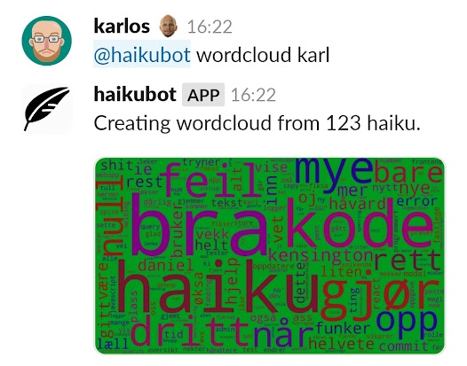

As a team building exercise, I made a Slack bot that posts Haikus to a Slack channel from the descriptions of pull
requests.

Every single pull request had to have a somewhat relevant haiku in the description. The bot would then post the haiku to
a Slack channel.

This was in 2016, so the bot was specifically made for a self-hosted "Stash" (by Atlassian) instance. It lived for
roughly 5 years, posting almost 4000 haikus before it was decommissioned.

It had a few features, such as being able to create word clouds from the haikus.

As well as manually adding haikus, show some stats for longest word, most used words, etc. It also had a score board
showing who had the most haikus.
