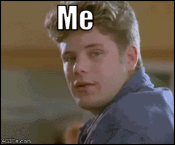
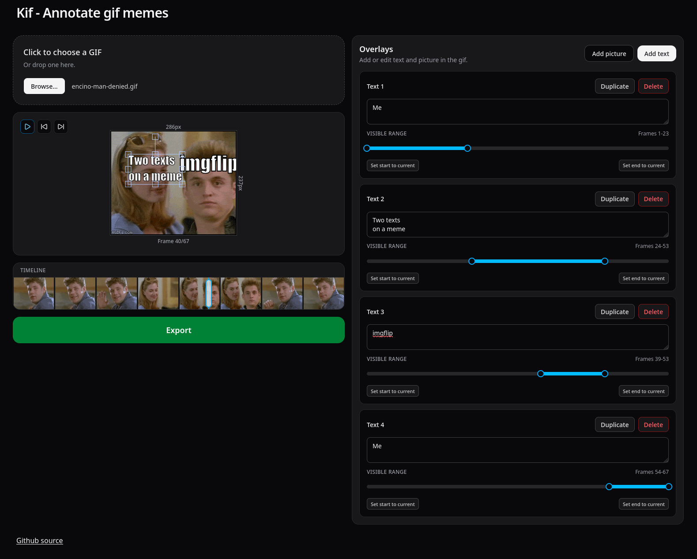

Sometimes you just want to make a funny meme where you overlay a couple of texts on top of an existing gif, and maybe
the texts should show on only parts of the gif. For example like this:

I'm a big fan of [imgflip](https://imgflip.com), and I've used it a lot, but one of their ways of monetising is limiting
you to overlay a single text on top of a gif, and you have to pay $12 a month for two or more.

So I created "Kif" (short for "Karl's Gif Utility"):

It lets you overlay as many texts and images as you want, and choosing which frames they are visible on. You can also
pause the gif, and step though frame for that extra level of precision!

It's 100% browser based, so everything runs locally in your browser.

Try it on [kif.karl.run](https://kif.karl.run).
