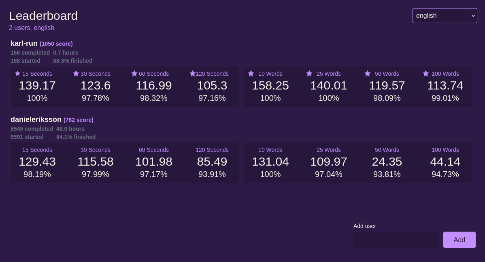

import GaugeCollection from '@components/GaugeCollection.astro';

# {frontmatter.title}

<GaugeCollection values={frontmatter.projectValues} direction="row" />

I wanted to compare scores between specific users for specific types of [Monkeytype](https://monkeytype.com/) modes. It
was too difficult to see who was best.

The premise is simple, you add the users you want, and these are persisted in the URL so it is easier to share or link
to, good for pinning in Slack-channels etc.

The user that has the overall best times for the category gets placed on top, and for each type of run (time- or
word-based), you get a little sparkling star.

A little fun bonus feature is that the users are persisted to a cookie as well, so if you return to the root-domain you
are automatically redirected to the correct URL-state.

Create your own scoreboards and share with your friends at [monke.karl.run](https://monke.karl.run).
