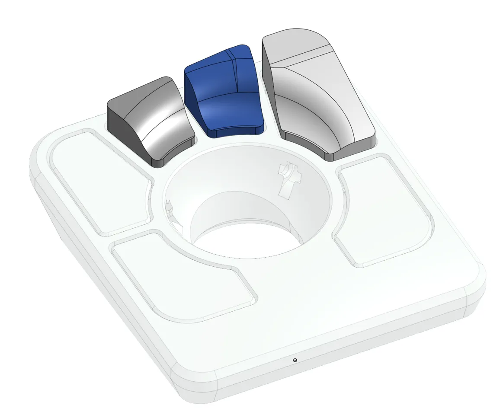
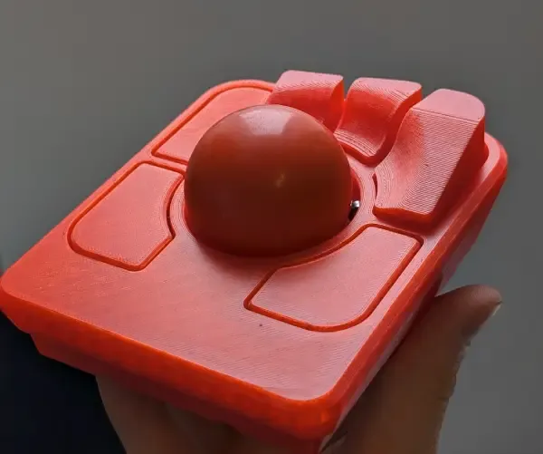

The [Ploopy Adept](https://ploopy.co/adept-trackball/) is a open source ball mouse good for ergonomics. Personally I
like to mix between a vertical mouse for recreational use, and a ball mouse for programming/development.

One thing I missed on the "stock" Adept mouse was a certain contour to the 3-4 back buttons, making them easier to
reach. So I given that the mouse is open source, and its 3D-printed case model are available, I used
[Onshape](https://onshape.com) to create some raisers to the existing buttons that could simply be 3D-printed and glued
on the existing case.

I own two Ploopy Adepts (one for office, and one for home office). Both have this mod installed.

 

This model actually has quite a few downloads on Printables. It's not the only "raised button" mod for the Adept, but
it's nice to know others are getting some use out of this as well.

There is a bigger variety of left and right, and 3 and 4 button models on the
[Printables project page](https://www.printables.com/model/1018787-raised-buttons-for-ploopy-adept) for the model. Feel
free to give it a try! Remember to read the docs about slicing and printing.
