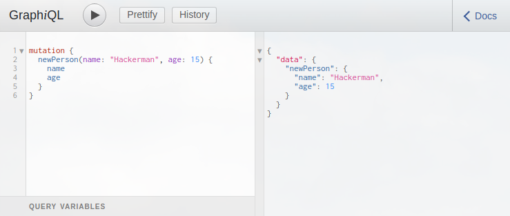

There are a lot of ways to run a GraphQL web server. The quickest ways to get started if you are starting a new project is to use something like [Apollo Server](https://www.apollographql.com/docs/apollo-server/) on node. It'll kick you off with a "schema-first" sensible and easy to use way to define your GraphQL resolvers. But if you're in Java-land and want to add GraphQL to your existing Spring Boot server there are a few steps you need to take.

Don't know what GraphQL is but is interested in learning? Have a look at [graphql.org](https://graphql.org/learn/)'s very nice intro to GraphQL.

### Schema-first

First of, what do I mean with "schema-first" GraphQL? A lot of the reference implementations of GraphQL force you to define your schema as code, often through builders, and sowing them together your self. In that context having a "schema-first" GraphQL server means that you first define your GraphQL-schema in it's own file, using the GraphQL-syntax, then providing resolvers and objects to match with this schema.

## Implementation

I assume that you already have a Spring Boot server running. If you don't, go to [Spring Initializr](https://start.spring.io/) and create a starter. Remember to add the `Web` dependency.

There are a few important libraries that we will use that will make this a very simple process (and a short blog post).

 - `graphql-spring-boot-starter`
 - `graphiql-spring-boot-starter`

[Documentation for these starters](https://github.com/graphql-java/graphql-spring-boot#requirements-and-downloads).

These two are the bread and butter of GraphQL on spring boot. We need to add them as dependencies and enable them.

Let's add them to our dependencies along with your existing dependencies.

```bash
dependencies {
  ...
  compile 'com.graphql-java:graphql-spring-boot-starter:5.0.2'
  compile 'com.graphql-java:graphiql-spring-boot-starter:5.0.2'
}
```

Then to enable it we need to add to your `application.yml` (or properties if you don't use yml):

```yml
graphql:
 servlet:
  mapping: /api/graphql
  enabled: true

graphiql:
 mapping: /graphiql
 endpoint: /api/graphql
 enabled: true
```

If you start your server now, you can visit `http://localhost:8080/graphiql` and you should be met with the interactive GraphQL console.

 

You will see a 404 error in the result view saying that `/api/graphql` could not be found. That's because we need to configure our schema.

To do that we are going to use [graphql-java-tools](https://github.com/graphql-java/graphql-java-tools). This is the library that will let us provide our schema as `.graphqls` files, provide our resolvers and mutations through implementing simple interfaces.

Add it to your dependencies.

```bash
dependencies {
  ...
  compile 'com.graphql-java:graphql-java-tools:5.2.0'
}
```

In your resources folder, create a file called `schema.graphqls`, if you want you can also but this in a folder of your choice.

In this file we define our root schema. Let's start of very simple:

```graphql
type Query {
  hello: String!
}
```

Now we will quickly provide our first resolver, simply create a new Java file, for example `RootQueryResolver.java`.

```java
package run.karl.graphqlblogpost;

import com.coxautodev.graphql.tools.GraphQLQueryResolver;
import org.springframework.stereotype.Component;

@Component
public class RootQueryResolver implements GraphQLQueryResolver {

  public String getHello() {
    return "Hello World!";
  }
}
```

This class is simply a class that implements `GraphQLQueryResolver`, that provides a function that matches with our schema. The function could also be called just `hello()`, `graphql-java-tools` looks for both.

 It is `@Component` so that Spring Boot picks it up as a bean.

 Start your server, and go to `http://localhost:8080/graphiql` (or refresh if you still have it open). Try executing a query:

 

Success!

## Defining a bigger schema

 Now let's explore on how to extend on this. First add a new root query to your schema:

```graphql
type Query {
  hello: String!
  bye: String!
}
```

Without providing a new query resolver, restart your server.

You will see a pretty long stack trace, but the most important take-away is this:

```bash
Caused by: org.springframework.beans.BeanInstantiationException: Failed to instantiate [com.coxautodev.graphql.tools.SchemaParser]: Factory method 'schemaParser' threw exception; nested exception is com.coxautodev.graphql.tools.FieldResolverError: No method or field found with any of the following signatures (with or without one of [interface graphql.schema.DataFetchingEnvironment] as the last argument), in priority order:

  run.karl.graphqlblogpost.RootQueryResolver.bye()
  run.karl.graphqlblogpost.RootQueryResolver.getBye()
  run.karl.graphqlblogpost.RootQueryResolver.bye
```

As soon as you add a resolver, be in a query resolver, mutation or object resolver, `graphql-java-tools` is going to scan all beans of type `GraphQLQueryResolver`, `GraphQLMutationResolver` and `GraphQLResolver<T>` for your implementation. If it at start-up time can't find it, it's going to fail. Nice! Keep in mind that the more resolvers you have provided, the longer the stack trace is going to be.

Let us update our query resolver with `getBye()`

```java
@Component
public class RootQueryResolver implements GraphQLQueryResolver {

  public String getHello() {
    return "Hello World!";
  }

  public String getBye() {
    return "Oh no! Bye..";
  }
}
```

Restart your server and try to query for it.

## Working with objects

For GraphQL to be useful you need to be able to define object structures. In a GraphQL-schema it is as easy as providing an additional `type`.

```graphql
type Person {
  name: String!
  age: Int
}

type Query {
  hello: String!
  bye: String!
  karl: Person!
}
```

Notice that `age: Int` isn't followed by a exclamation mark? That means that the value is nullable. Dive further into the details of [GraphQL-schemas here](https://graphql.org/learn/schema/).

Now update the query resolver, note the @Data in the example is a [lombok](https://projectlombok.org/) annotation to generate getters and setters. You don't have to use this! But it makes the code a lot more terse for examples. 👨‍💻

```java
@Component
public class RootQueryResolver implements GraphQLQueryResolver {

  public String getHello() {
    return "Hello World!";
  }

  public String getBye() {
    return "Oh no! Bye..";
  }

  public Person getKarl() {
    Person karl = new Person();
    karl.name = "Karl O.";
    karl.age = 29;

    return karl;
  }

  @Data
  public class Person {
    private String name;
    private int age;
  }
}
```

Restart the server and try this query: 

```graphql
query {
  hello
  karl {
    name
    age
  }
}
```

 

 ## Parameters

 Now asking for a `karl` specifically isn't very interesting. Change `karl` to `person` and add a parameter to it.

```graphql
type Person {
  name: String!
  age: Int
}

type Query {
  hello: String!
  bye: String!
  person(who: String!): Person!
}
```

When adding parameters to a query, simply add them to your implementation signature.

```java
@Component
public class RootQueryResolver implements GraphQLQueryResolver {

  public String getHello() {
    return "Hello World!";
  }

  public String getBye() {
    return "Oh no! Bye..";
  }

  // Updated signature!
  public Person getPerson(String who) {
    if (who.toLowerCase().equals("karl")) {
      return new Person("Karl O.", 29);
    }

    return new Person("Unknown", null);
  }

  @Data
  @AllArgsConstructor
  public class Person {

    private String name;
    private Integer age;
  }
}
```

Restart the server and test out the new query. In this example I'm using query aliases to run multiple of the same query at the same time.


 ## Resolving values on objects

 So we have a `Person` type that our users can ask for, but let's add a value on `Person` that will only be fetched if the query specifically asks for it.

 Add it to your schema:

 ```graphql
type Person {
  name: String!
  age: Int
  complexValue: Int!
}

type Query {
  hello: String!
  bye: String!
  person(who: String!): Person!
}
```

Now create a new file called `PersonResolver.java`.

Implement the function that `graphql-java-tools` expects to find.

```java
@Component
public class PersonResolver implements GraphQLResolver<Person> {

  public int getComplexValue(Person person) {
    System.out.println("Fetching value for person '" + person.getName() + "'");
    return veryComplexFetchingOfValue(person.getName());
  }

  private int veryComplexFetchingOfValue(String name) {
    if (name.equals("Karl O.")) {
      return 42;
    }

    return 3;
  }
}
```

When defining object resolvers, you need to implement the interface based on the data-object you want to resolve from. In this case we are implementing `GraphQLResolver<Person>`, meaning that any resolver from a `Person`-object we define here, will receive the person object that has already been resolved as a input, so you can use that to further decide what value to fetch or calculate.

Restart the server and test out this new query.


 Take a close look at your server output.

 ```bash
 Fetching value for person 'Karl O.'
 ```

Here you can see that it only resolved this `complexValue` for the query that specifically asked for it.

 ## Mutations

 Mutations is GraphQL's word for "any query that will change some data". They are very similar to queries, both in how you define them in your schema and how you implement them as resolvers, but they are completely separate.

 Add the mutation to our schema.

 ```graphql
type Person {
  name: String!
  age: Int
  complexValue: Int!
}

type Query {
  hello: String!
  bye: String!
  person(who: String!): Person!
}

type Mutation {
  newPerson(name: String!, age: Int): Person!
}
```

Create a new file called `RootMutationResolver.java`.

```java
@Component
public class RootMutationResolver implements GraphQLMutationResolver {

  private final PersonDatabase personDatabase;

  @Autowired
  public RootMutationResolver(PersonDatabase personDatabase) {
    this.personDatabase = personDatabase;
  }

  public Person newPerson(String name, Integer age) {
    Person person = new Person(name, age);

    personDatabase.save(person);

    return person;
  }
}
```

This class provides a `newPerson` function with the correct signature to match what we specified in the schema. It simply creates the value, persists it and returns the new value.

 

 Now have a fully functional API with both reading and writing!

 

The source code for this blog post can be found at [karl-run/graphql-blogpost](https://github.com/karl-run/graphql-blogpost) on GitHub.