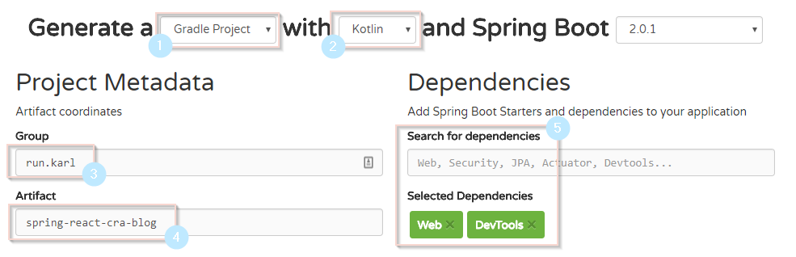

In this post we will cover a simple way to get started with developing a full-stack application using Spring Boot 2 with Kotlin, that builds and bundles a React-application and serves it statically. The react application will use [create-react-app](https://github.com/facebook/create-react-app) for a simple way to setup and develop a SPA (single page application).

**This post will be very beginner-friendly.**

The main points of interest will be:

1.  [Spring Initializr to set up a gradle project](#using-spring-initializr-to-get-started-with-spring-boot)
2.  [Creating a module structure](#creating-a-module-structure)
3.  [Making them talk together](#making-them-talk-together)
4.  [Packing it all together](#packing-it-all-together)
5.  [Adding Spek for our backend tests](#adding-spek-for-our-backend-tests)

tl;dr: You're not interested in the details and you just want to get started? Clone [this repo](https://github.com/karl-run/spring-boot-kotlin-cra) and get coding, and disregard the rest of this blog post.

# Using Spring Initializr to get started with Spring Boot

The quickest and easiest way to get started with a Spring Boot application is to use [Spring Initializr](https://start.spring.io/). Let's go through the following options.



1.  Whether or not you want to use Gradle or Maven to build this project is up to you, but in this tutorial we will use Gradle.
2.  Select `Kotlin` as a programming language.
3.  `Group` is your unique identifier, if you're a private person this can be your domain in reverse, or if you don't have a domain you can use your GitHub account on the form of `com.github.yourusername`. My domain is karl.run so I'll use `run.karl`.
4.  `Artifact` is the name of your application.
5.  Dependencies is the Spring Boot features you'd like to start with. Don't worry, you can add these later, but we will start of with "Web" and "DevTools" that'll give us what we need to start.

Hit `Generate project` and download the zip.

# Creating a module structure

There are many ways to structure your applications. In this case we will set up a completely separate React application that only uses the Spring Boot server as an API. However, to simplify deployment we want the Spring Boot server to statically serve the React application for us. That way we only have to deploy a single artefact (a `.jar` file) as a single server.

The route we will take here is to keep the two modules (React and Spring Boot) as separate as possible, and only join them together when we create our production build.

## Set up the skeleton

Create a new folder with your project name, for example `spring-react`. Create a folder inside this called `server` and unzip the contents of the zip from Spring Initializr into it. We should then have a folder structure that looks like this:

```bash
spring-react/
    server/
        .gitignore
        src/
        gradle/
        gradlew*
        gradlew.bat
        build.gradle
```

You can go ahead and `cd` into `server` and run `./gradlew build` to verify that the Spring Boot build from Spring Initializr has been set up correctly. If everything is fine you should see a `BUILD SUCCESSFUL` after a few seconds.

Now create a new folder next to `server` and call it `web`. Next make sure you have installed [Node](https://nodejs.org/en/), to verify that you have installed this correcly you should be able to do `node -v` and `npm -v` and see its version. Make sure it is relatively new (the LTS version should be enough). Once Node is installed, with `spring-react` as your working directory, run:

`npx create-react-app web`

This will set up a no configuration build for your React application.

Our folder structure should now look like this:

```bash
spring-react/
    server/
        .gitignore
        src/
        gradle/
        gradlew*
        gradlew.bat
        build.gradle
    web/
        .gitignore
        src/
        public/
        node_modules/
        package.json
        package-lock.json
```

Now that we have our two modules where we want them, we can start them at the same time.

Inside `server` run:
`./gradlew bootRun`

Inside `web` run:
`npm start`

This will start our backend Spring Boot application on `localhost:8080` and our frontend React application on `localhost:3000`, and you cat visit these URLs in your browser, although none of them will do anything particularly interesting yet.

# Making them talk together

Now starts the fun part. For this post we will make a simple REST-endpoint that returns some JSON and make it available on `/api/hello`. We will then make our React application request the data from this endpoint and display it.

## REST endpoint

I won't go too much depth into how to make API with Spring Boot. Look at the [Spring Boot Web Applications](https://docs.spring.io/spring-boot/docs/current-SNAPSHOT/reference/html/boot-features-developing-web-applications.html) documentation for more details.

Next to your `Application.kt` file, create a new package. In this new package, create a new file that will be our controller.

```kotlin
/* src/main/run/karl/starter/example/ExampleController.kt */

@RestController()
class ExampleController {

    @GetMapping("/api/hello", produces = ["application/json"])
    fun example() = "Hello World!"
}
```

If you start the application and visit `http://localhost:4000/api/hello` you will see the message `Hello World!`.

Now we will split this code into a controller that uses a service. This service will be autowired into our controller. This will make the application a lot easier to test later on.

In the same package, create a new file called `ExampleService.kt`.

```kotlin
/* src/main/run/karl/starter/example/ExampleService.kt */

@Service
class ExampleService {
    data class ExampleResponse(val message: String)

    fun getSomeValue() = ExampleResponse("Hello Service!")
}
```

The data class helps us to serialize our response into a properly formatted JSON object.

Now we will update our controller to get this `ExampleService`-class autowired through its constructor.

```kotlin
/* src/main/run/karl/starter/example/ExampleController.kt */

@RestController()
class ExampleController @Autowired constructor(
        private val exampleService: ExampleService
) {
    @GetMapping("/api/hello", produces = ["application/json"])
    fun example() = exampleService.getSomeValue()
}
```

The only change here is that we added a constructor that accepts the service (you can have multiple arguments in this constructor), and the constructor is annotated with `@Autowired`, meaning that Spring Boot will handle instantiating and passing these classes to our controller.

If we run the application and visit `/api/hello` again we will see `{"message":"Hello World!"}`. Note that this magically became a JSON-object because we returned a `data class` instead of a string. Now we are ready to consume this from our React-application!

## Requesting from React

Now that we have our backend up and running, let's jump into our React-application.

To make development a lot easier, first we need to tell create-react-app to proxy all our `/api` requests to our Spring Boot development server. In `web/package.json`, we add a the following property to the end of the file:

`"proxy": "http://localhost:8080"`

Now when we make a request from our React-application to a relative path such as `/api/hello` it will be proxied to the running Spring Boot application on a different port! Very useful.

Now, let's make sure we run both our backend and our frontend and the same time, but separately Run the backend with `./gradlew bootRun` from the `server` folder. If you prefer, configure your IDE to execute the Spring Boot application (very useful for debugging). Now in a separate terminal go to the `web` folder and run `npm start`.

Visit `http://localhost:3000` to see the default create-react-app page.

Now let's make a request to our backend! In `web/App.js`, let's add a state to store our response, as well as add a life-cycle method that will be executed when the component is mounted, which will fetch the message from the backend.

```jsx
class App extends Component {
  state = {
    message: null,
  }

  componentDidMount() {
    // Make a GET-request to our backend
    fetch('/api/hello')
      // Map the result to a JSON-object
      .then(response => response.json())
      // Put the message in the state
      .then(response => {
        this.setState({ message: response.message })
      })
  }

  render() {
    return (
      <div className="App">
        <p>Message from backend: {this.state.message}</p>
      </div>
    )
  }
}
```

Now your React-application should already have hot-reloaded, made a request to the backend and displayed it. If you get a error message with `Proxy error: Could not proxy request /api/hello` in the terminal, it means you either aren't running your Spring Boot application at the same time, or that you have the wrong URL in your `proxy`-property in `package.json`.

Now that you have your backend and your frontend communicating, create your web-application!

# Packing it all together

When you want to ship your web-application, you need to pack it into an artefact that you can deploy somewhere. There are a plethora of different ways to do this, but in this tutorial we will build the React-application, copy the files into the Spring Boot application as static files, then build the Spring Boot application into a JAR-file. That file, we can deploy anywhere that supports the JVM, or package it into a Docker-container and make it even more generic.

## Build the frontend

create-react-app has already done all the heavy lifting for us, simply running `npm build` creates a nicely minified, production-ready build. The only thing we need to do is move the files in `web/build/` into `server/src/main/resources/static`. We want to do that automatically every time `npm build` is executed.

To do that, we are going to add two useful npm-modules, but only as dev-dependencies.

`npm add -D copyfiles cross-env`.

Then under `scripts`, we add two new script-targets, one that tests and builds our React-application and one that copies our files to the correct location.

```json
    "build:gradle": "cross-env CI=true npm run test && npm run build",
    "postbuild": "copyfiles -u 1 build/**/* ../server/src/main/resources/static"
```

We name it `build:gradle` because we want to keep our normal `build`-script, and `:gradle` indicates that we'll usually run this from our gradle-script in the other module. By naming the other script-target `postbuild` it will automatically execute any time we run `build`.

Try our new build and copy script by running `npm run build:gradle` in the `web`-folder.

Any application should be able to be build scratch using a single command, that means that we need to configure our backend to automatically run the frontend build as well.

In `server/build.gradle` we need to add a gradle-plugin that lets us invoke npm commands easily. Under `buildscript/dependencies`, add the following dependency:

`classpath("com.moowork.gradle:gradle-node-plugin:1.2.0")`

Apply the plugin next to the other plugins: `apply plugin: 'com.moowork.node'`.

Now we add two tasks at the bottom of our `build.gradle`. One task will install the frontend dependencies, the other will execute `build:gradle` from our `package.json`. Then we configure gradle so that any time `./gradlew build` is executed, it first builds the frontend application, before packing that and Spring Boot application together to one JAR-file.

```groovy
// Task for installing frontend dependencies in web
task installDependencies(type: NpmTask) {
    args = ['install']
    execOverrides {
        it.workingDir = '../web'
    }
}

// Task for executing build:gradle in web
task buildWeb(type: NpmTask) {
    args = ['run', 'build:gradle']
    execOverrides {
        it.workingDir = '../web'
    }
}

// Before buildWeb can run, installDependencies must run
buildWeb.dependsOn installDependencies

// Before build can run, buildWeb must run
build.dependsOn buildWeb
```

Simple! No magic here. Just a gradle plugin that helps us to execute npm from gradle, and some simple task `dependsOn` chaining.

To check that everything works as expected, run `./gradlew build` from the `server`-folder. If you see `BUILD SUCCESSFUL`, try running your production-ready JAR-file directly, which you can do from the `server`-folder with `java -jar build/libs/server-0.0.1-SNAPSHOT.jar`.

Visit `http://localhost:8080` to see your Spring Boot hosted React-application that communicates with a Spring Boot REST-API.

# Extra tip: Making Spring Boot behave when serving a single page application (SPA)

SPAs prefer to handle their routing self. Which means that if you build a React-application that uses [React Router](https://github.com/ReactTraining/react-router) or [Reach Router](https://github.com/reach/router), and you don't want `/#/` part of your URL, you need to configure Spring Boot to route any non-root (`/`) route back to root.

Luckily that can be fixed with this little workaround. Next to `Application.kt` create a new file called `WebConfig.kt`.

```kotlin
@Configuration
class WebConfig {

    @Bean
    fun webServerFactory(): ConfigurableServletWebServerFactory {
        val factory = TomcatServletWebServerFactory()
        factory.errorPages.add(ErrorPage(HttpStatus.NOT_FOUND, "/"))
        return factory
    }
}
```

All this does is silently redirect you to `/` if Spring Boot would normally respond with `404 NOT FOUND`. Now you can visit any route on your application, and they will all end up on your React-SPA.

# Adding Spek for our backend tests

Testing a Spring Boot application is very simple if you use dependency injection, as we did earlier with `@Autowired`.

Let us start with testing `ExampleService.kt`, as it has no dependencies it will give us an opportunity to look at how Spek tests are structured. For more details on Spek, checkout their [documentation](http://spekframework.org/docs/latest/).

We need to add Spek and [hamkrest](https://github.com/npryce/hamkrest) (assertion library) as a dependency in `server/build.gradle`, add this on the root level `dependencies`-block.

```groovy
    testCompile('org.springframework.boot:spring-boot-starter-test')
    testCompile('org.jetbrains.spek:spek-api:1.1.5')
    testCompile('com.natpryce:hamkrest:1.4.2.2')
    testRuntime('org.jetbrains.spek:spek-junit-platform-engine:1.1.5')
```

We also need to add this on root of the `build.gradle`:

```groovy
junitPlatform {
    filters {
        engines {
            include 'spek'
        }
    }
}
```

Create the test file for `ExampleService.kt`. Test files are always in the same package-structure as the file that is being tested, but situated under the `test` folder instead of `main`.

Meaning that the test file for

`server\src\main\kotlin\run\karl\starter\example\ExampleService.kt`

Should be

`server\src\test\kotlin\run\karl\starter\example\ExampleServiceSpec.kt`

`Spec` here is short for "Specification".

Since `ExampleService.kt` is a very simple class, the tests will be very simple.

```kotlin
object ExampleServiceSpec : Spek({
   describe("a very good service") {
       val exampleService = ExampleService()

       it("should return the correct value") {
           val value = exampleService.getSomeValue()

           // hamkrest lets us write assertions that read like a normal sentence
           assert.that(value.message, equalTo("Hello World!") and startsWith("Hello"))
       }

       it("should not return the not correct value") {
           val value = exampleService.getSomeValue()

           assert.that(value.message, !equalTo("Something completely different!"))
       }
   }
})
```

A Spek-test consists of a root-describe, which can have more describes nested under itself, and/or one to many `it`. The `it` blocks are where the actual assertions will take place. Build a logical structure that builds natural flowing sentences. For example

```kotlin
describe("a boat") {
  describe("given a motor") {
    it("should go forward") {...}
    it("should float") {...}
  }
  describe("given a huge rock") {
    it("should sink") {...}
  }
}
```

`ExampleService.kt` was super simple with no external dependencies making it very simple to test. To test `ExampleController.kt` which has `ExampleService.kt` as a dependency, we need to mock the service.

To get our mock on, we need a new [mockito-kotlin](https://github.com/nhaarman/mockito-kotlin).

```groovy
    testCompile 'com.nhaarman:mockito-kotlin:1.5.0'
```

Create `server\src\test\kotlin\run\karl\starter\example\ExampleControllerSpec.kt`.

```kotlin
object ExampleControllerSpec : Spek({
    describe("a very good controller") {
        // Create a mock of ExampleService
        val mockedExampleService = mock<ExampleService> {
            /* Define that when getSomeValue is invoked, return this
               value instead of executing the original code */
            on { getSomeValue() } doReturn ExampleService.ExampleResponse("Mocked Message Wahoo!")
        }
        /* Specify that we want to use our mocked
           ExampleService by passing it in as a named parameter */
        val controller = ExampleController(exampleService = mockedExampleService)

        it("should return invoke service but return mocked message") {
            val value = controller.example()

            assert.that(value.message, equalTo("Mocked Message Wahoo!") and endsWith("Wahoo!"))
        }
    }
})
```

Using mockito-kotlin to define behaviours of our mocked classes is very natural and quick. Follow the comments in the above example.

Remember that this tutorial is available as a ready to use template on [github/karl-run](https://github.com/karl-run/spring-boot-kotlin-cra).

---

If you find anything wrong in this blog post, don't hesitate to leave a comment or send me a mail at karl@karl.run. I'm always happy for feedback!
